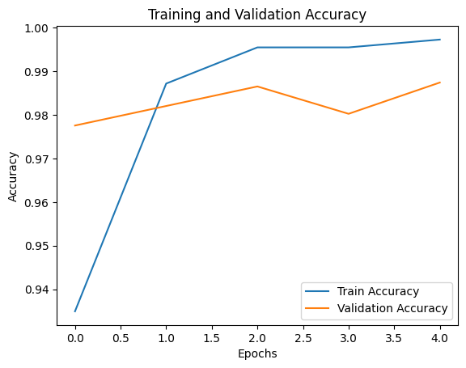

# 📱 SMS Spam Detection using RNN

This project is a deep learning-based SMS spam classifier built using a Recurrent Neural Network (RNN) model with TensorFlow and Keras. The goal is to classify messages as either **ham (not spam)** or **spam** using natural language processing techniques.

## 🧠 Overview

The dataset used is the classic **SMSSpamCollection**, which contains 5,572 labeled messages. Text data is preprocessed and fed into an RNN model built with TensorFlow's Functional API. The model is trained to learn the structure and semantics of spam messages, offering accurate predictions with confidence levels.

## 🔧 Features

- Data preprocessing with tokenization and padding
- Binary classification with RNN layers
- Early stopping for efficient training
- Accuracy and loss plotting
- Real-time message prediction with confidence score

## 📁 Dataset

- **File:** `SMSSpamCollection`
- **Format:** Tab-separated (`\t`)
- **Columns:**
  - `label`: `ham` or `spam`
  - `text`: The SMS content

## 🛠️ Project Structure

```bash
sms_spam_detection/
├── sms+spam+collection/
│   ├── SMSSpamCollection     # Dataset file
│   └── readme                # Dataset readme
├── requirements.txt          # Python dependencies
├── sms_spam_detection.ipynb  # Jupyter Notebook with RNN model
├── sms_spam_detection.pdf    # Project documentation (PDF)
└── README.md                 # Project documentation (Markdown)
```

## 📊 Preprocessing

- Convert labels (`ham` -> 0, `spam` -> 1)
- Tokenize and pad messages (max words = 5000, sequence length = 100)

```python
tokenizer = Tokenizer(num_words=5000)
tokenizer.fit_on_texts(sms_data['text'])
sequences = tokenizer.texts_to_sequences(sms_data['text'])
X = pad_sequences(sequences, maxlen=100)
```

## 🧩 Model Architecture

- **Embedding Layer**
- **Two SimpleRNN Layers** (64 and 32 units)
- **Dense Layer** with ReLU
- **Dropout Layer**
- **Final Dense Layer** with Sigmoid for binary output

```python
x = tf.keras.layers.Embedding(vocab_size, 128)(inputs)
x = tf.keras.layers.SimpleRNN(64, return_sequences=True)(x)
x = tf.keras.layers.SimpleRNN(32)(x)
x = tf.keras.layers.Dense(16, activation='relu')(x)
x = tf.keras.layers.Dropout(0.5)(x)
outputs = tf.keras.layers.Dense(1, activation='sigmoid')(x)
```

## 🚀 Training

- **Optimizer:** Adam
- **Loss Function:** Binary Crossentropy
- **EarlyStopping** to prevent overfitting

```python
model.fit(X, y, epochs=10, batch_size=32, validation_split=0.2, callbacks=[early_stopping])
```

### Example Training Output:

```
Epoch 1/10 - val_accuracy: 97.76%
Epoch 2/10 - val_accuracy: 98.21%
...
```

## 📈 Performance Visualization

Training and validation accuracy over epochs:



## 🔍 Predicting New Messages

```python
sample_text = "Free entry in 2 a wkly comp to win FA Cup final tkts..."
result = predict_sentiment(sample_text)
print(result)
# Output: {'sentiment': 'Spam', 'confidence': 0.9956}
```

## ✅ Requirements

- Python 3.x
- TensorFlow
- Pandas
- Matplotlib

Install dependencies with:

```bash
pip install -r requirements.txt
```
